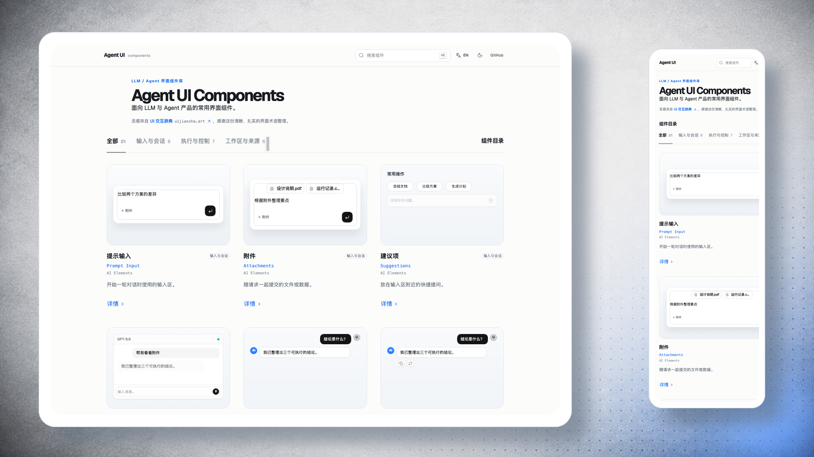

# Agent UI Components

[在线浏览](https://lavapapa.github.io/agent-ui-kit/)



一个面向 LLM、AI 与 Agent 产品的界面组件索引。它把常见的交互界面放进克制的局部场景中，帮助人在看见界面时叫得出组件的名字，也能继续查看对应的实现提示。

## 包含什么

首页收录 21 个来自 AI Elements 的常见组件，按输入与会话、执行与控制、工作区与来源分组。例如：

- 提示输入、附件、建议项、对话容器、消息与消息分支
- 模型选择器、上下文用量、思维链、工具调用、计划、任务队列与操作确认
- 产物面板、Agent 卡片、画布、行内引用、来源列表与终端输出

每个条目都提供中文名称、英文名称、简短说明和详情页。详情页附有可复制的实现提示，供编码 Agent 或开发者继续实现。

## 使用方式

- 使用顶部搜索和分类筛选定位组件。
- 切换中英文界面，以及明暗主题。
- 打开任一组件的详情页，查看更大的展示和实现提示。

## 技术与组件来源

页面以 React / Vite 构建，展示主体采用 [AI Elements](https://ai-sdk.dev/elements) 与 [shadcn/ui](https://ui.shadcn.com/) 组件，而非用手写结构伪造组件外观。该仓库当前保存 GitHub Pages 所需的静态发布产物；本地预览可在仓库根目录运行：

```bash
npx serve .
```

## 致谢

界面的索引形式受到 [UI 交互辞典](https://uijiaosha.art/) 启发。感谢它对界面术语所做的清晰整理。
